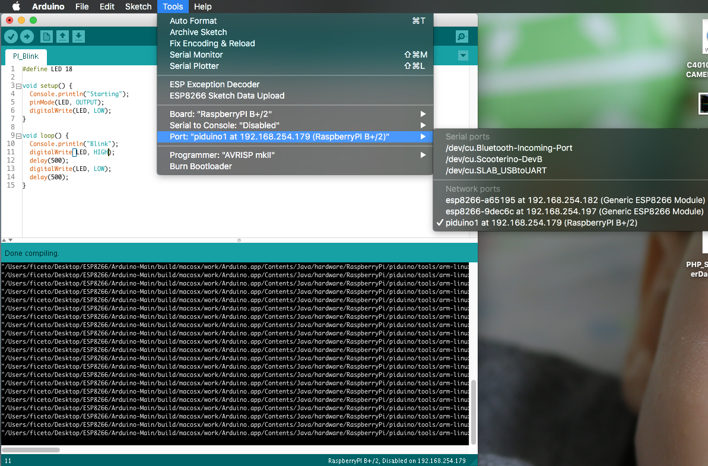
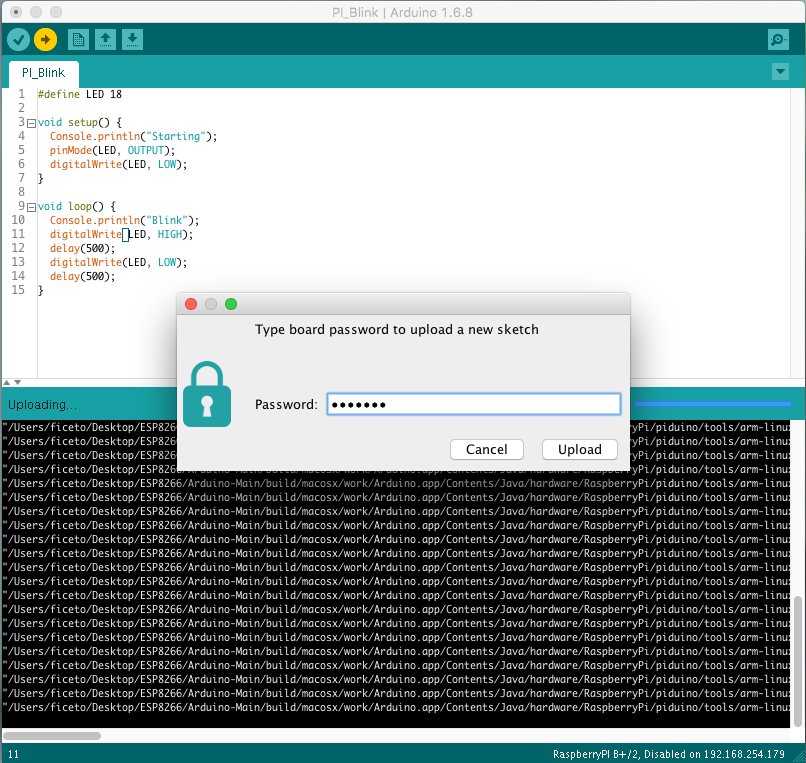
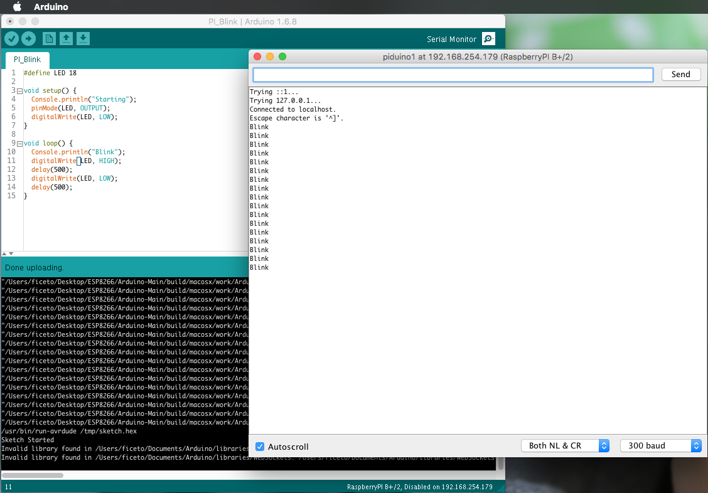

# RasPiArduino

## Arduino Framework for RaspberryPI
### Features
- The familiar Arduino API
- pinMode/digitalRead/digitalWrite/analogWrite
- Full SPI, Wire and Serial compatibility
- Access to STDIN/STDOUT through the Console class
- Access to system tty through the TTY library
- Process, FileIO, Client, Server and UDP implementations through the Bridge library

### Instructions for the RaspberryPi
* Install Raspbian Jessie on your RaspberryPI
* Run these commands in the terminal.
```bash
wget https://raw.githubusercontent.com/yasir1brahim/RasPiArduino/master/scripts/configurePi.sh
chmod +x configurePi.sh
./configurePi.sh
```

### Instructions for the Arduino IDE
There are 2 ways to set up the Arduino IDE :

* Using the Board Manager
* Using the Bash script

#### Using the Board Manager
* Copy the URL for your Operating System

Linux
```bash
https://raw.githubusercontent.com/yasir1brahim/RasPiArduino/master/package_raspberrypiLinux_index.json
```
OSx
```
Pre Requisite :-
Run this command in the terminal to install gettext : brew install gettext
```
Windows
```bash
https://raw.githubusercontent.com/yasir1brahim/RasPiArduino/master/package_raspberrypiWin_index.json
```

```bash
https://raw.githubusercontent.com/yasir1brahim/RasPiArduino/master/package_raspberrypiOSx_index.json
```
* Run the Arduino IDE .
* Go to File -> Preferences (Ctrl + Comma)
* Paste the URL in 'Additional Boards Manager URLs'
* Go to Tools -> Boards -> Boards Manager
* Choose 'Contributed' from the drop down at the top left.
* Install 'Raspberry by DanKaminsky'

#### Using the Bash script
* Open the installation folder of Arduino IDE
* Run these commands in the terminal.
```bash
wget https://raw.githubusercontent.com/yasir1brahim/RasPiArduino/master/scripts/configureArduinoIDE.sh
chmod +x configureArduinoIDE.sh
./configureArduinoIDE.sh
```
### If everything went well
* Restart Arduino IDE and select RaspberryPI from the list of boards
* Compile a sketch
* Select the RespberryPi from the list of Ports (will show the IP address)
* Upload your sketch and see it go

#### Selecting the board from the list of ports


#### Password prompt before upload


#### Monitoring the sketch



### Links to external tutorials
* [VIDEO: Setup Arduino IDE for Windows](https://www.youtube.com/watch?v=lZvhtfUlY8Y)
